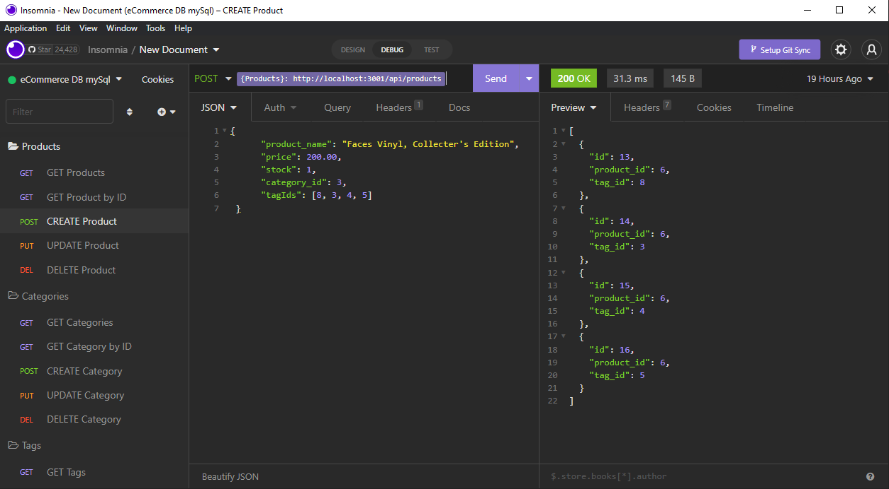

# eCommerce Back End  
[](http://unlicense.org/)  
## Description  
This project was an assignment for class; My task was to build out a back end for a mock eCommerce site. I was given a partially completed Express API to finish building, and created a DB to connect to using Sequelize and mySQL.

## [Walkthrough video](https://watch.screencastify.com/v/lfARg4JkxEwvjn3SzrYE)



## Table of Contents  
* [Details](#details)  
       * [Technologies](#technologies)  
       * [Dependencies](#dependencies)  
* [Installation](#installation)  
* [Usage](#usage)  
* [Questions](#questions)  
* [Credits](#credits)  
----  
## Details  
### Technologies  
Node is used to run this app, mySQL and Sequelize for DB, Express for serving, and dotenv for storing enviroment variables.  
### Dependencies  

  * dotenv 8.2 
  * express 4.17.1    
  * mysql2 2.1
  * sequelize 5.21.7  
  
----  
    
## Installation  
Clone this repository locally, and navigate to the root in your terminal. Use ```npm i``` to install dependencies with Node. 
## Usage  
Use mySQL to ```SOURCE db/schema.sql``` and create the database. Then seed the starting data with ```npm run seed```. Finally, start the server locally by using ```npm run seed```.   
  
----  
  ## Questions  
  
>Got questions? Reach out to me at:  
>My [Github](https://github.com/JaquelRey)  
>Email: [jaquelrey@gmail.com](mailto:jaquelrey@gmail.com)  
  
----  
  ## Credits  
### Authors  
Jaquel Rey  
### Resources  
Docs for mySQL server and w3Schools were great resources for me on this project.  
